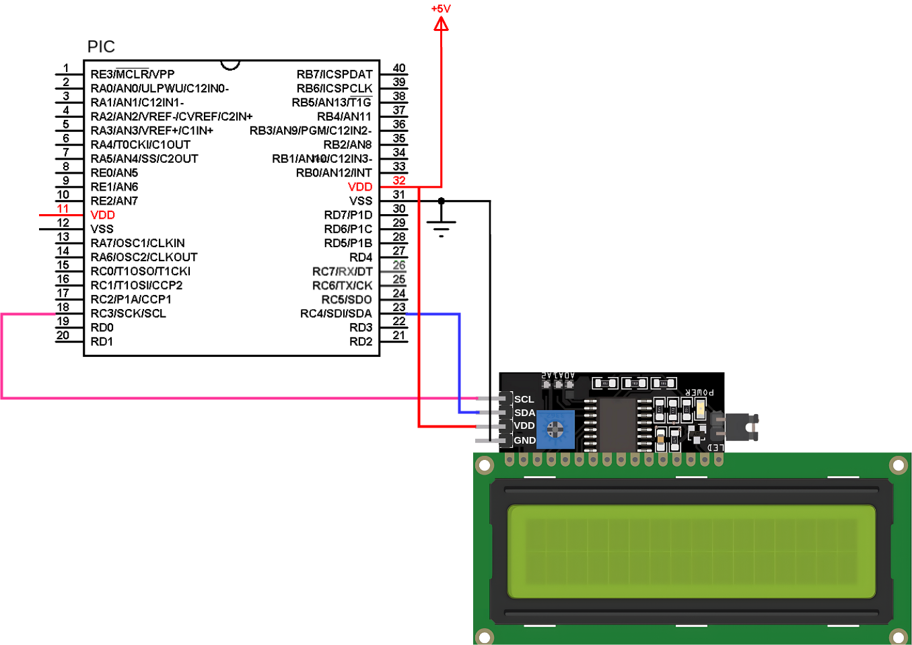
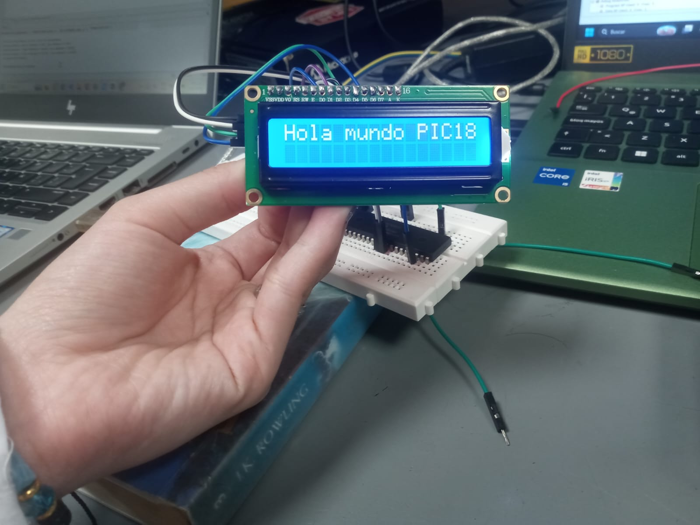

# Lab07: Visualización en LCD 16x2 usando módulo I²C con microcontrolador PIC

## Integrantes

[Samuel Forero](https://github.com/Sam232510)

[Danna Pineda](https://github.com/Danna-Pineda)

## Introducción 

En esta práctica de laboratorio se desarrolló un sistema de visualización gráfica utilizando una pantalla LCD controlada mediante comunicación I2C y un microcontrolador PIC. El objetivo principal fue implementar una simulación del proceso de carga de una batería empleando caracteres personalizados creados en la memoria interna de la pantalla LCD, permitiendo representar diferentes niveles de carga de manera visual y dinámica.

Para el desarrollo de la práctica se configuró el módulo I2C del microcontrolador con el fin de establecer la comunicación serial con la pantalla LCD, reduciendo así la cantidad de pines necesarios para su control, además se utilizaron funciones de programación en lenguaje C para manipular la pantalla, mostrar mensajes de estado y actualizar continuamente el porcentaje de carga de la batería.

## Documentación

### I2C_LCD.C 

    #include <xc.h>
    #include "i2c.h"
    #include "i2c_lcd.h"

Este bloque incluye las librerías necesarias para el funcionamiento del programa. La librería xc.h contiene los registros y configuraciones del microcontrolador PIC, mientras que i2c.h y i2c_lcd.h contienen las funciones necesarias para manejar la comunicación I2C y controlar la pantalla LCD mediante el adaptador I2C.

        void lcd_init(void)
    {
        __delay_ms(20);
        lcd_cmd(0x33);
        lcd_cmd(0x32);
        lcd_cmd(0x28);
        lcd_cmd(0x0C);
        lcd_cmd(0x06);
        lcd_cmd(0x01);
        __delay_ms(3);
    }

Este bloque configura e inicializa la pantalla LCD para su funcionamiento. Primero se realiza una pequeña espera para garantizar que la pantalla esté estable después del encendido. Luego se envían varios comandos mediante la función lcd_cmd() para configurar la LCD en modo de 4 bits, habilitar dos líneas de visualización, encender la pantalla, desactivar el cursor, configurar el desplazamiento automático del cursor y limpiar completamente el display, despues se agrega un pequeño retardo para asegurar que la LCD procese correctamente las configuraciones realizadas.

    void lcd_cmd(unsigned char cmd)
    {
        char data_u, data_l;
        data_u = (cmd & 0xF0);
        data_l = ((cmd << 4) & 0xF0);

        I2C_start();
        I2C_write(ADDRESS_LCD);
        I2C_write(data_u | 0x0C);
        I2C_write(data_u | 0x08);
        I2C_write(data_l | 0x0C);
        I2C_write(data_l | 0x08);
        I2C_stop();
    }

Este bloque define una función encargada de enviar comandos de control a la pantalla LCD utilizando comunicación I2C. Debido a que la pantalla trabaja en modo de 4 bits, el comando recibido se divide en una parte alta y una parte baja. Luego se inicia la comunicación I2C, se envía la dirección de la LCD y posteriormente se transmiten ambas partes del comando activando la señal Enable necesaria para que la pantalla lea correctamente la información y despues se detiene la comunicación I2C.

    void lcd_write_char(char c)
    {
        char data_u, data_l;
        data_u = (c & 0xF0);
        data_l = ((c << 4) & 0xF0);

        I2C_start();
        I2C_write(ADDRESS_LCD);
        I2C_write(data_u | 0x0D);
        I2C_write(data_u | 0x09);
        I2C_write(data_l | 0x0D);
        I2C_write(data_l | 0x09);
        I2C_stop();
    }

Este bloque permite enviar un carácter individual a la pantalla LCD. El carácter recibido se divide en dos partes debido al modo de operación de 4 bits. Después se inicia la comunicación I2C y se transmite el carácter a la pantalla activando el bit RS, el cual indica que los datos enviados corresponden a caracteres y no a comandos de control. Finalmente se finaliza la comunicación serial I2C.

    void lcd_set_cursor(unsigned char row, unsigned char col)
    {
        if (row == 0) lcd_cmd(0x80 + col);
        else lcd_cmd(0xC0 + col);
    }

    void lcd_write_string(const char *str)
    {
        while(*str != '\0')
        {
            lcd_write_char(*str++);
        }
    }

    void lcd_clear(void)
    {
        lcd_cmd(0x01);
        __delay_ms(2);
    }

Este bloque contiene funciones auxiliares para controlar la pantalla LCD. La función lcd_set_cursor() permite mover el cursor a una posición específica indicando la fila y la columna donde se desea escribir, la función lcd_write_string() permite enviar cadenas completas de texto recorriendo cada carácter hasta encontrar el final de la cadena y al final la función lcd_clear() limpia completamente la pantalla LCD utilizando el comando de borrado y realizando un pequeño retardo para asegurar que la operación se complete correctamente.

    void lcd_create_char(unsigned char location, unsigned char *charmap)
    {
        location &= 0x07;

        lcd_cmd(0x40 | (location << 3));

        for(unsigned char i = 0; i < 8; i++)
        {
            lcd_write_char(charmap[i]);
        }

        lcd_cmd(0x80);
    }

Este bloque permite crear caracteres personalizados en la memoria interna de la pantalla LCD. Primero se selecciona una posición válida entre 0 y 7, ya que la LCD únicamente puede almacenar ocho caracteres personalizados. Luego se accede a la memoria CGRAM de la pantalla y se escriben los ocho bytes que definen gráficamente el nuevo carácter, y duespues se retorna al modo de escritura normal para continuar mostrando información en la pantalla.

### I2C.C

    #include "i2c.h"

Este bloque incluye la librería i2c.h, donde se encuentran definidas las funciones, configuraciones y constantes necesarias para manejar la comunicación I2C en el microcontrolador PIC.

    void I2C_init(void)
    {
        TRIS_SCL = 1;
        TRIS_SDA = 1;
        
        ANSEL_SCL = 0;
        ANSEL_SDA = 0; 
        
        SSPSTAT = 0x80;
        SSPCON1 = 0x28;
        SSPCON2 = 0x00;
        SSPADD = 119;

        SSPCON1bits.SSPEN = 1;
    }

Este bloque configura e inicializa el módulo I2C del microcontrolador. Primero se configuran los pines SCL y SDA como entradas, ya que las líneas I2C trabajan en modo de colector abierto. Luego se desactivan las funciones analógicas de esos pines para permitir su uso como comunicación digital. Posteriormente se configuran los registros del módulo MSSP encargados del funcionamiento I2C, estableciendo el modo maestro y definiendo la velocidad de comunicación mediante el registro SSPADD, despues se habilita el módulo I2C activando el bit SSPEN.

    void I2C_start(void)
    {
        SSPCON2bits.SEN = 1;
        while(!PIR1bits.SSPIF);
        PIR1bits.SSPIF = 0;
    }

Este bloque genera la condición START de la comunicación I2C, al activar el bit SEN, el microcontrolador inicia la transmisión en el bus I2C, luego el programa espera hasta que la operación finalice verificando la bandera SSPIF y despues la bandera de interrupción se limpia para permitir futuras operaciones.

    void I2C_stop(void)
    {
        SSPCON2bits.PEN = 1;
        while(!PIR1bits.SSPIF);
        PIR1bits.SSPIF = 0;
    }

Este bloque genera la condición STOP de la comunicación I2C. Al activar el bit PEN, el microcontrolador finaliza la transmisión de datos en el bus I2C. Después se espera a que la operación termine y finalmente se limpia la bandera de interrupción.

    void I2C_write(unsigned char data)
    {
        SSPBUF = data;
        while(!PIR1bits.SSPIF);
        PIR1bits.SSPIF = 0;
    }

Este bloque permite transmitir un byte de datos mediante comunicación I2C. el dato recibido como parámetro se carga en el registro SSPBUF, encargado de enviar la información serialmente. luego el programa espera hasta que la transmisión finalice verificando la bandera SSPIF despues la bandera se limpia para preparar el módulo para nuevas transmisiones.

### MAIN CON SCROLL DE UNA CANCIÓN 

    #pragma config FOSC = INTIO67
    #pragma config PLLCFG = OFF
    #pragma config WDTEN = OFF
    #pragma config LVP = OFF
    #pragma config PBADEN = OFF

    #define _XTAL_FREQ 48000000UL

    #include <xc.h>

    #include "i2c.h"
    #include "i2c_lcd.h"

Este bloque configura los parámetros principales del microcontrolador PIC y carga las librerías necesarias. Se selecciona el oscilador interno como fuente de reloj, se desactiva el PLL, el Watchdog Timer y la programación por bajo voltaje, también se deshabilita la configuración analógica automática del puerto B. La constante _XTAL_FREQ define la frecuencia del sistema en 48 MHz, necesaria para el funcionamiento correcto de las funciones de retardo, despues se incluyen las librerías para el manejo del microcontrolador, la comunicación I2C y el control de la pantalla LCD.

    void scrollTexto(const char *texto)
    {
        unsigned int len = 0;

        while(texto[len] != '\0')
            len++;

        for(unsigned int inicio = 0; inicio < len; inicio++)
        {
            lcd_set_cursor(0,0);

            for(unsigned char k = 0; k < 16; k++)
            {
                if((inicio + k) < len)
                    lcd_write_char(texto[inicio + k]);
                else
                    lcd_write_char(' ');
            }

            __delay_ms(250);
        }

        lcd_clear();
    }

Este bloque define una función llamada scrollTexto() encargada de mostrar texto en movimiento sobre la pantalla LCD, primero se calcula la longitud total de la cadena recibida, luego mediante ciclos repetitivos, el texto se desplaza carácter por carácter sobre una pantalla de 16 columnas. la función posiciona el cursor al inicio de la LCD y escribe únicamente los caracteres visibles en cada instante, si ya no existen más caracteres disponibles se completan los espacios vacíos con espacios en blanco entre cada desplazamiento se aplica un retardo de 250 ms para generar el efecto visual de movimiento y por ultimo la pantalla se limpia al terminar el recorrido del texto.

    void main(void)
    {
        // Oscilador interno
        OSCCON = 0x70;

        // Desactivar analogicos
        ANSELC = 0x00;
        ANSELD = 0x00;
        ANSELE = 0x00;

        // Inicializar I2C
        I2C_init();

        __delay_ms(100);

        // Inicializar LCD
        lcd_init();

        lcd_clear();
    }

Este bloque corresponde al inicio de la función principal del programa. Primero se configura el oscilador interno del microcontrolador mediante el registro OSCCON. Luego se desactivan las funciones analógicas de los puertos C, D y E para utilizarlos como entradas y salidas digitales. Después se inicializa la comunicación I2C mediante la función I2C_init(), seguida de un pequeño retardo de estabilización. Finalmente se inicializa la pantalla LCD utilizando lcd_init() y se limpia la pantalla para comenzar desde un estado vacío.

    while(1)
    {
        // TITULO
        lcd_set_cursor(0,0);
        lcd_write_string("Martin Elias");

        lcd_set_cursor(1,0);
        lcd_write_string("♪ Vallenato ♪");

        __delay_ms(3000);

        lcd_clear();
    }

Este bloque inicia un ciclo infinito donde el programa ejecuta continuamente la visualización de mensajes en la LCD, primero se muestra el nombre “Martin Elias” en la primera línea y “♪ Vallenato ♪” en la segunda línea de la pantalla luego se mantiene esta información visible durante tres segundos y posteriormente la pantalla se limpia para continuar con el resto del programa.

    scrollTexto("Bueno mi amor esta cancion es con el alma para ti   ");

    scrollTexto("Yo siento que volvi a nacer desde que te conoci   ");

    scrollTexto("No me queda espacio para nadie soy solo tuyo   ");

    scrollTexto("Menos mal que tuve suerte y pude conquistarte   ");

    scrollTexto("Diez razones para mi vivir   ");

    scrollTexto("Para descansar y despertar   ");

    scrollTexto("Diez razones para ser feliz disfrutando tu amor   ");

    scrollTexto("Conocerte enamorarte comprenderte valorarte   ");

    scrollTexto("Respetarte y consentirte extranarte y pensarte   ");

    scrollTexto("Serte fiel y tenerte diez razones para amarte   ");

Este bloque utiliza repetidamente la función scrollTexto() para mostrar fragmentos de la canción en la pantalla LCD cada frase se desplaza horizontalmente por la pantalla generando un efecto dinámico de movimiento de texto el proceso se realiza de forma secuencial para cada línea de la canción.

    lcd_set_cursor(0,0);
    lcd_write_string("10 Razones");

    lcd_set_cursor(1,0);
    lcd_write_string("Para Amarte");

    __delay_ms(4000);

    lcd_clear();

Este bloque muestra el mensaje final del programa en la pantalla LCD. En la primera línea se escribe “10 Razones” y en la segunda línea “Para Amarte” el mensaje permanece visible durante cuatro segundos antes de limpiar nuevamente la pantalla.

### MAIN ANIMACIÓN PROPIA 

    #pragma config FOSC = INTIO67
    #pragma config PLLCFG = OFF
    #pragma config WDTEN = OFF
    #pragma config LVP = OFF
    #pragma config PBADEN = OFF

    #define _XTAL_FREQ 48000000UL

    #include <xc.h>

    #include "i2c.h"
    #include "i2c_lcd.h"

Este bloque configura el funcionamiento principal del microcontrolador PIC y carga las librerías necesarias para el proyecto. Se selecciona el oscilador interno como fuente de reloj, se desactiva el PLL, el Watchdog Timer y la programación de bajo voltaje también se deshabilita la configuración analógica automática del puerto B la constante _XTAL_FREQ define la frecuencia del sistema en 48 MHz, necesaria para calcular correctamente los retardos y por ultimo se incluyen las librerías para controlar la comunicación I2C y la pantalla LCD.

    void crearCaracteres()
    {
        unsigned char pistola[8] = {
            0b00100,
            0b00110,
            0b11111,
            0b11111,
            0b00110,
            0b00100,
            0b00100,
            0b00000
        };

        unsigned char blanco[8] = {
            0b00100,
            0b01110,
            0b10101,
            0b10101,
            0b10101,
            0b01110,
            0b00100,
            0b00000
        };

        unsigned char bala[8] = {
            0b00000,
            0b00000,
            0b00100,
            0b00100,
            0b00000,
            0b00000,
            0b00000,
            0b00000
        };

        unsigned char explosion[8] = {
            0b00100,
            0b10101,
            0b01110,
            0b11111,
            0b01110,
            0b10101,
            0b00100,
            0b00000
        };

        unsigned char pacmanDer[8] = {
            0b01110,
            0b11011,
            0b11100,
            0b11110,
            0b11100,
            0b11011,
            0b01110,
            0b00000
        };

        unsigned char pacmanIzq[8] = {
            0b01110,
            0b11011,
            0b00111,
            0b01111,
            0b00111,
            0b11011,
            0b01110,
            0b00000
        };

        lcd_create_char(0, pistola);
        lcd_create_char(1, blanco);
        lcd_create_char(2, bala);
        lcd_create_char(3, explosion);
        lcd_create_char(4, pacmanDer);
        lcd_create_char(5, pacmanIzq);
    }

Este bloque define la función crearCaracteres(), encargada de crear caracteres personalizados para la pantalla LCD utilizando la memoria CGRAM cada arreglo de 8 bytes representa gráficamente un carácter de 5x8 píxeles se diseñan diferentes figuras como una pistola, un blanco, una bala, una explosión y dos versiones de Pacman mirando en distintas direcciones por ultimo cada diseño se almacena en una posición específica de la memoria de la LCD mediante la función lcd_create_char().

    void mostrarContador(unsigned int tiros,
                        unsigned char pos,
                        unsigned char posAnterior,
                        unsigned char dir)
    {
        // Fila 2
        lcd_set_cursor(1,0);

        lcd_write_string("Tiros:");

        lcd_write_char((tiros % 10) + '0');

        lcd_write_string("   ");

        // Borrar Pacman anterior
        lcd_set_cursor(1,10 + posAnterior);

        lcd_write_string(" ");

        // Dibujar Pacman nuevo
        lcd_set_cursor(1,10 + pos);

        if(dir)
            lcd_write_char(4);
        else
            lcd_write_char(5);
    }

Este bloque define la función mostrarContador(), utilizada para actualizar la segunda fila de la pantalla LCD. Primero se muestra el texto “Tiros:” junto con el número actual de disparos realizados luego se elimina la posición anterior del personaje Pacman escribiendo un espacio en blanco por ultimo se dibuja nuevamente el personaje en su nueva posición, utilizando un carácter personalizado diferente dependiendo de la dirección de movimiento.

    void main(void)
    {
        // Oscilador
        OSCCON = 0x70;

        // Desactivar analogicos
        ANSELC = 0x00;
        ANSELD = 0x00;
        ANSELE = 0x00;

        // Inicializar I2C
        I2C_init();

        __delay_ms(100);

        // Inicializar LCD
        lcd_init();

        lcd_clear();

        // Crear caracteres personalizados
        crearCaracteres();
    }

Este bloque corresponde al inicio del programa principal. Primero se configura el oscilador interno del microcontrolador y se desactivan las funciones analógicas de los puertos utilizados. Después se inicializa la comunicación I2C y la pantalla LCD, realizando una limpieza inicial de la pantalla y por ultimo se llama a la función crearCaracteres() para cargar en la memoria de la LCD todos los caracteres personalizados que serán utilizados durante la animación.

    unsigned char col;

    unsigned int tiros = 0;

    unsigned char pacPos = 0;
    unsigned char pacPosAnterior = 0;

    unsigned char direccion = 1;

Este bloque declara las variables utilizadas durante la ejecución del programa la variable col controla la posición horizontal de la bala, la variable tiros almacena el número de disparos realizados. pacPos y pacPosAnterior guardan la posición actual y anterior de Pacman para permitir su animación desoues la variable direccion controla hacia qué lado se mueve Pacman.

    while(1)
    {
        // Pistola
        lcd_set_cursor(0,0);

        lcd_write_char(0);

        // Blanco
        lcd_set_cursor(0,15);

        lcd_write_char(1);

        // Animacion bala
        for(col = 1; col < 15; col++)
        {
            lcd_set_cursor(0,col);

            lcd_write_char(2);

            __delay_ms(120);

            lcd_set_cursor(0,col);

            lcd_write_string(" ");
        }

        // Explosion
        lcd_set_cursor(0,15);

        lcd_write_char(3);

        __delay_ms(200);

        // Restaurar blanco
        lcd_set_cursor(0,15);

        lcd_write_char(1);

        // Incrementar tiros
        tiros++;

        // Guardar posicion anterior
        pacPosAnterior = pacPos;

        // Movimiento Pacman
        if(direccion)
            pacPos++;
        else
            pacPos--;

        // Cambio direccion
        if(pacPos >= 4)
            direccion = 0;

        if(pacPos == 0)
            direccion = 1;

        // Mostrar contador
        mostrarContador(tiros,
                        pacPos,
                        pacPosAnterior,
                        direccion);

        __delay_ms(300);
    }

Este bloque contiene el ciclo principal del programa y controla toda la animación mostrada en la pantalla LCD. Primero se dibuja una pistola en el extremo izquierdo de la pantalla y un blanco en el extremo derecho luego se ejecuta una animación donde una bala se desplaza horizontalmente desde la pistola hasta el blanco al llegar al destino se muestra una explosión y posteriormente se restaura el blanco original, después se incrementa el contador de disparos y se actualiza la posición de Pacman en la segunda fila de la pantalla el personaje cambia automáticamente de dirección al llegar a los extremos definidos y por ultimo la función mostrarContador() actualiza toda la información visual antes de repetir nuevamente el proceso.

### MAIN ANIMACIÓN BATERÍA 

    #pragma config FOSC = INTIO67
    #pragma config PLLCFG = OFF
    #pragma config WDTEN = OFF
    #pragma config LVP = OFF
    #pragma config PBADEN = OFF

    #define _XTAL_FREQ 48000000UL

    #include <xc.h>

    #include "i2c.h"
    #include "i2c_lcd.h"

Este bloque configura los parámetros principales del microcontrolador PIC y carga las librerías necesarias para el funcionamiento del programa se utiliza el oscilador interno como fuente de reloj y se desactivan funciones como el PLL, el Watchdog Timer y la programación de bajo voltaje además, se define la frecuencia de trabajo del sistema en 48 MHz mediante _XTAL_FREQ, lo cual es necesario para el cálculo correcto de retardos y por ultimo se incluyen las librerías encargadas de controlar la comunicación I2C y la pantalla LCD.

    void cargarBateria(unsigned char nivel)
    {
        unsigned char charmap[8];

        for(unsigned char i = 0; i < 8; i++)
        {
            if(i == 0 || i == 7)
            {
                charmap[i] = 0x0E;
            }

            else if(i >= (7 - nivel))
            {
                charmap[i] = 0x1F;
            }

            else
            {
                charmap[i] = 0x11;
            }
        }

        lcd_create_char(0, charmap);
    }

Este bloque define la función cargarBateria(), encargada de generar dinámicamente un carácter personalizado con forma de batería para la pantalla LCD. La función recibe como parámetro el nivel de carga de la batería y construye el diseño gráfico utilizando un arreglo de 8 bytes llamado charmap. Mediante un ciclo for, se rellenan distintas partes de la batería dependiendo del nivel recibido. Las filas superior e inferior forman el borde de la batería, mientras que las filas internas cambian para representar visualmente el porcentaje de carga despues el carácter generado se almacena en la memoria CGRAM de la LCD utilizando la función lcd_create_char().

    void main(void)
    {
        // Oscilador
        OSCCON = 0x70;

        // Desactivar analogicos
        ANSELC = 0x00;
        ANSELD = 0x00;
        ANSELE = 0x00;

        // Inicializar I2C
        I2C_init();

        __delay_ms(100);

        // Inicializar LCD
        lcd_init();

        lcd_clear();

        unsigned char nivel = 0;
    }

Este bloque corresponde al inicio del programa principal. Primero se configura el oscilador interno del microcontrolador mediante el registro OSCCON. Luego se desactivan las funciones analógicas de los puertos utilizados para permitir su funcionamiento digital. Posteriormente se inicializa la comunicación I2C y la pantalla LCD, aplicando un pequeño retardo de estabilización y limpiando la pantalla. Finalmente se declara la variable nivel, encargada de almacenar el nivel actual de carga de la batería.

    while(1)
    {
        // Crear bateria
        cargarBateria(nivel);

        // -------- FILA 1 --------
        lcd_set_cursor(0,0);

        if(nivel < 4)
            lcd_write_string("Cargando...   ");
        else
            lcd_write_string("Cargado       ");

        // -------- FILA 2 --------
        lcd_set_cursor(1,0);

        lcd_write_string("Bat:");

        // Mostrar batería
        lcd_write_char(0);

        lcd_write_string(" ");

        // Mostrar porcentaje
        if(nivel == 0)
            lcd_write_string("0%   ");

        if(nivel == 1)
            lcd_write_string("25%  ");

        if(nivel == 2)
            lcd_write_string("50%  ");

        if(nivel == 3)
            lcd_write_string("75%  ");

        if(nivel == 4)
            lcd_write_string("100% ");

        __delay_ms(800);

        nivel++;

        if(nivel > 4)
            nivel = 0;
    }

Este bloque contiene el ciclo principal del programa y controla toda la simulación de carga de batería mostrada en la pantalla LCD. Primero se llama a la función cargarBateria() para generar el carácter gráfico correspondiente al nivel actual de carga luego, en la primera fila de la LCD, se muestra el mensaje “Cargando...” mientras la batería aún no está completa y “Cargado” cuando alcanza el nivel máximo, en la segunda fila se escribe el texto “Bat:” seguido del carácter personalizado de la batería y el porcentaje de carga correspondiente. Después de un retardo de 800 ms, el nivel de batería aumenta automáticamente cuando el nivel supera el valor máximo, el contador vuelve a cero para reiniciar la animación continuamente.

## Diagramas

Figura 1. Montaje i2c más lcd
## Evidencias de implementación

Figura 2. Texto fijo "Hola mundo PIC18"

Figura 3. Animación bateria con i2c.

Figura 4. Animación propia con i2c. 

Figura 5. Texto con Scroll con i2c.
## Preguntas

1. ¿Por qué I²C se clasifica como half-duplex mientras que SPI es full-duplex? ¿Qué implicación práctica tiene esa diferencia para el control de una LCD?.

I²C se clasifica como un protocolo half-duplex porque utiliza una sola línea de datos (SDA) para transmitir y recibir información, por lo que la comunicación solo puede ocurrir en un sentido a la vez; en cambio, SPI es full-duplex debido a que posee líneas separadas para envío y recepción de datos (MOSI y MISO), permitiendo transmitir y recibir simultáneamente. En el control de una LCD, esto implica que I²C ofrece una comunicación más lenta pero con menos uso de pines del microcontrolador, siendo ideal para pantallas sencillas como las LCD 16x2, mientras que SPI permite una transferencia de datos mucho más rápida y eficiente, lo cual es ventajoso en pantallas gráficas o aplicaciones donde se requiere actualizar gran cantidad de información continuamente.

2. En I2C_init() se asigna SSPCON1 = 0x28. Desglose ese valor bit a bit e identifique qué modo de operación del MSSP se está seleccionando y por qué se elige ese valor.

El valor `SSPCON1 = 0x28` en hexadecimal corresponde a `00101000` en binario. Desglosando bit a bit: el bit 5 (`SSPEN = 1`) habilita el módulo MSSP para permitir la comunicación serial, mientras que los bits `SSPM3:SSPM0 = 1000` seleccionan el modo I²C Master. Los demás bits permanecen en 0 porque no se requiere detección de colisión ni otras funciones adicionales en esta configuración. Este valor se elige porque permite configurar el PIC como maestro I²C, encargado de generar la señal de reloj SCL y controlar la comunicación con dispositivos esclavos, como una LCD con adaptador I²C.

3. Las funciones I2C_start(), I2C_stop() e I2C_write() comparten el mismo patrón: activar un bit de control y luego esperar con while(!PIR1bits.SSPIF). ¿Qué representa la bandera SSPIF y por qué se limpia después de cada operación?.

La bandera `SSPIF` pertenece al registro `PIR1` y se activa cuando el módulo MSSP termina una operación de comunicación serial, como una condición Start, Stop, transmisión o recepción de datos en I²C. En las funciones `I2C_start()`, `I2C_stop()` e `I2C_write()`, el programa espera con `while(!PIR1bits.SSPIF)` hasta que el hardware indique que la operación finalizó correctamente. Después de cada operación, la bandera se limpia manualmente (`SSPIF = 0`) para preparar el módulo para la siguiente acción y evitar que el microcontrolador interprete una operación anterior como si fuera una nueva interrupción o evento completado.

4. El fuse PBADEN = OFF está presente en la configuración. ¿Qué efecto tendría dejarlo en ON sobre los pines del puerto B, y por qué podría causar problemas si se usan esos pines como salidas digitales?.

El fuse PBADEN = OFF desactiva la configuración analógica por defecto en los pines RB0 a RB4 del puerto B al iniciar el microcontrolador. Si se dejara en `ON`, esos pines arrancarían configurados como entradas analógicas en lugar de digitales, lo que impediría que funcionaran correctamente como salidas digitales. Como consecuencia, dispositivos conectados a esos pines, como LEDs, LCD o señales de control, podrían no responder, presentar niveles lógicos incorrectos o comportamientos inestables, ya que el módulo analógico toma prioridad sobre la lógica digital mientras no se reconfigure manualmente el puerto.

5. Compare el control de la LCD en modo paralelo (lab04) con el modo I²C de este laboratorio. Mencione ventajas y desventajas de cada enfoque en términos de: cantidad de pines usados, velocidad de actualización y complejidad del código.

El control de la LCD en modo paralelo utiliza más pines del microcontrolador, ya que requiere varias líneas de datos y control, pero ofrece una comunicación más rápida y directa., su principal desventaja es el aumento del cableado y la reducción de pines disponibles para otros dispositivos.

En cambio, el modo I²C solo utiliza dos líneas de comunicación (SDA y SCL), lo que simplifica las conexiones y ahorra pines del microcontrolador. Sin embargo, la velocidad de actualización es menor debido a que la transmisión se realiza de forma serial, y el código resulta un poco más complejo por el manejo del protocolo I²C.

En resumen, el modo paralelo es más rápido pero consume más recursos físicos, mientras que el modo I²C es más compacto y eficiente en conexiones, aunque ligeramente más lento y complejo de programar.

6. El bus I²C permite conectar múltiples esclavos con solo dos hilos. Si se quisiera agregar un segundo módulo PCF8574 al mismo bus (por ejemplo, para controlar un segundo LCD), ¿qué cambio mínimo sería necesario en el hardware y en el código?

Para agregar un segundo módulo PCF8574 al mismo bus I²C, el cambio mínimo en el hardware sería modificar la dirección I²C del segundo módulo utilizando los pines de configuración A0, A1 y A2, evitando así que ambos dispositivos tengan la misma dirección ambos módulos seguirían conectados a las mismas líneas SDA y SCL.

En el código, únicamente sería necesario definir una nueva dirección I²C para el segundo dispositivo y utilizar esa dirección al momento de enviar datos o comandos al segundo LCD, el microcontrolador podrá identificar y controlar cada módulo de forma independiente dentro del mismo bus I²C.

## Conclusiones

- Durante la práctica se logró implementar correctamente la comunicación I²C entre el microcontrolador PIC y la pantalla LCD, permitiendo controlar la visualización de datos utilizando únicamente dos líneas de comunicación.

- Se comprendió el funcionamiento del módulo PCF8574 como expansor de entradas y salidas, facilitando el control de la LCD y reduciendo considerablemente la cantidad de pines utilizados en comparación con el modo paralelo.

- Mediante la creación de caracteres personalizados fue posible desarrollar animaciones y representaciones gráficas dinámicas en la pantalla LCD, demostrando la versatilidad de este tipo de dispositivos en sistemas embebidos.

- La práctica permitió reforzar conocimientos relacionados con la configuración de periféricos, manejo de protocolos de comunicación serial, programación en lenguaje C y control de dispositivos externos mediante microcontroladores PIC.

## Referencias